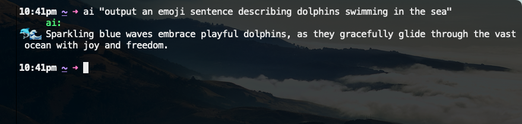

# AI-CLI

Simple CLI for ChatGPT.

## Requirements:

- Node version >= `18`
- API key

## Usage:

1. Clone or download this repository.
2. Run `npm link`. This links the commands from `package.json` to your path. Run `npm ls -g` to verify.
3. Run `export OPENAI_API_KEY="12345"`. Alternatively, add this to your `.zlogin`, or `.zshrc`, or similar.
4. `$ ai <message>` from anywhere.
