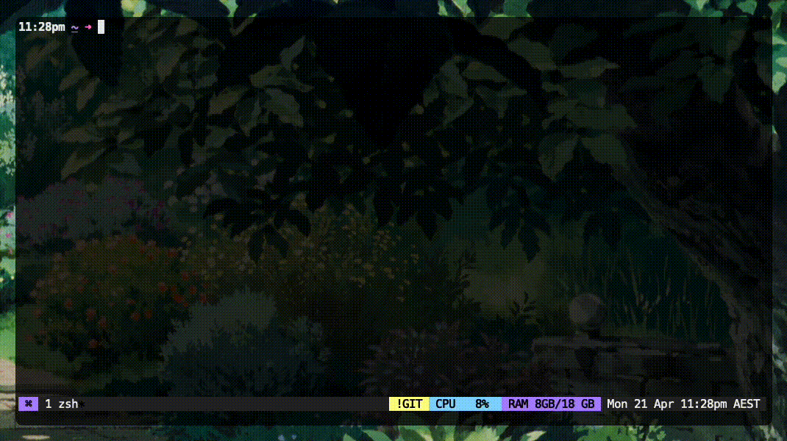

# AI-CLI

Simple LLM CLI.
1 file. 250 lines.

## Features:
- Interactive chat (OpenAI, Anthropic)
- Output to clipboard
- Multi-line input
- Prompt templates

## Requirements:
- Node version >= `20`
- Anthropic API key
- OpenAI API key

## Usage:
1. Clone or download this repo.
2. Run `npm link`.
3. Add `export OPENAI_CLI="12345"` and `export ANTHROPIC_CLI="12345"` to your `.zlogin`, `.zshrc`, or similar.
5. `$ ai` from anywhere.

## Why?
- Extreme simplicity. Intentionally minimal.\
  Fully featured alternatives:\
  - [Aider](https://github.com/Aider-AI/aider)
  - [simonw/llm](https://github.com/simonw/llm)
  - [aichat](https://github.com/sigoden/aichat)
